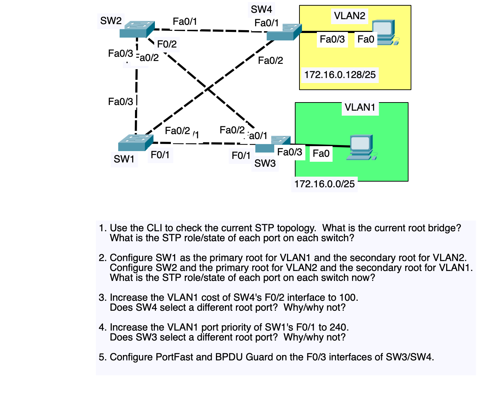

# Packet Tracer – Spanning Tree (STP) Lab (4 Switches, 2 VLANs)

A 4-switch redundant Layer-2 topology used to explore default STP behavior, root
bridge election, path cost, port priority, and PortFast/BPDU Guard.



## Objectives

1. Inspect the default STP topology via CLI — identify the root bridge and every
   port's role/state.
2. Make SW1 primary root / SW2 secondary root for VLAN 1, and the reverse for
   VLAN 2 — re-inspect port roles.
3. Raise the VLAN1 cost on SW4's Fa0/2 to 100 — observe whether SW4's root port
   changes.
4. Raise the VLAN1 port priority on SW1's Fa0/1 to 240 — observe whether SW3's
   root port changes.
5. Enable PortFast + BPDU Guard on the two access ports (SW3 Fa0/3, SW4 Fa0/3).

## Topology

```
        SW2 ------------------ SW4 -- Fa0/3 -- PC (VLAN2, 172.16.0.128/25)
       / |  \\               / |
  Fa0/3  F0/2 \\       Fa0/2 /  |
     /    |    \\           /   |
   SW1 ---+---- (cross) ---+   Fa0/1
     \\    F0/1  \\        /
      \\   |      \\      /
       \\  |       \\    /
        SW3 (Fa0/1, Fa0/2) -- Fa0/3 -- PC (VLAN1, 172.16.0.0/25)
```

| Link | Switch A / Port | Switch B / Port | Type |
|------|-------------------|-------------------|------|
| 1 | SW1 Fa0/3 | SW2 Fa0/3 | Trunk |
| 2 | SW1 Fa0/1 | SW3 Fa0/1 | Trunk |
| 3 | SW1 Fa0/2 | SW4 Fa0/2 | Trunk |
| 4 | SW2 Fa0/1 | SW4 Fa0/1 | Trunk |
| 5 | SW2 Fa0/2 | SW3 Fa0/2 | Trunk |
| 6 | SW3 Fa0/3 | PC (VLAN1) | Access, VLAN 1 |
| 7 | SW4 Fa0/3 | PC (VLAN2) | Access, VLAN 2 |

## Repository Structure

```
stp-lab/
├── README.md
├── configs/
│   ├── switches/
│   │   ├── SW1.txt        # root primary VLAN1 / secondary VLAN2 + Q4 port-priority
│   │   ├── SW2.txt        # root primary VLAN2 / secondary VLAN1
│   │   ├── SW3.txt        # access port + PortFast/BPDU Guard (Q5)
│   │   └── SW4.txt        # Q3 cost change + PortFast/BPDU Guard (Q5)
│   └── pcs.txt             # end-device IP addressing
├── docs/
│   ├── topology-overview.md      # links, VLANs, why loops exist
│   ├── answers-worksheet.md      # methodology + answers for Q1-Q5
│   └── verification-commands.md  # show-command cheat sheet
└── topology/
    └── topology-diagram.png
```

## How to Use

1. Build the topology in Packet Tracer exactly as shown above (4 switches, 5
   inter-switch trunk links, 2 end devices).
2. **Before applying any config**, complete Question 1: run the commands in
   `docs/verification-commands.md` on all four switches and record the current
   root bridge + port roles in `docs/answers-worksheet.md`.
3. Paste in the base VLAN/trunk portion of each switch's config from
   `configs/switches/`.
4. Apply the Step 2 root primary/secondary commands, then re-verify (Question 2).
5. Apply the Step 3 cost change on SW4 only, then re-verify (Question 3).
6. Apply the Step 4 port-priority change on SW1 only, then re-verify (Question 4).
7. Apply the Step 5 PortFast/BPDU Guard commands on SW3 and SW4's Fa0/3, then
   verify with `show spanning-tree interface fa0/3 detail`.

> Each switch config file is laid out in the same Q1->Q5 order as the lab
> questions — apply it incrementally (pause after each `! STEP n` block) rather
> than pasting the whole file at once, so you can observe the topology change
> at each stage.

## Key Concepts Reinforced

- **Bridge ID** = Priority + MAC address; lowest wins the root election.
- **Per-VLAN root selection** (PVST+) — different VLANs can have different root
  bridges and therefore different blocked/forwarding ports on the same trunk.
- **Root path cost** decides root port selection between switches; **port
  priority** only breaks ties on the *sending* switch's side, not the receiver's
  root-port choice.
- **PortFast** skips STP's Listening/Learning delay on access ports.
- **BPDU Guard** err-disables a port that unexpectedly receives a BPDU, protecting
  access ports from accidental loops.
